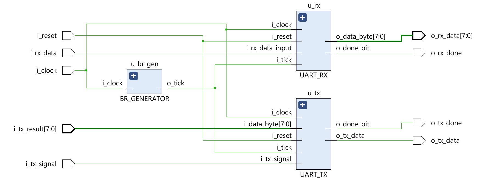
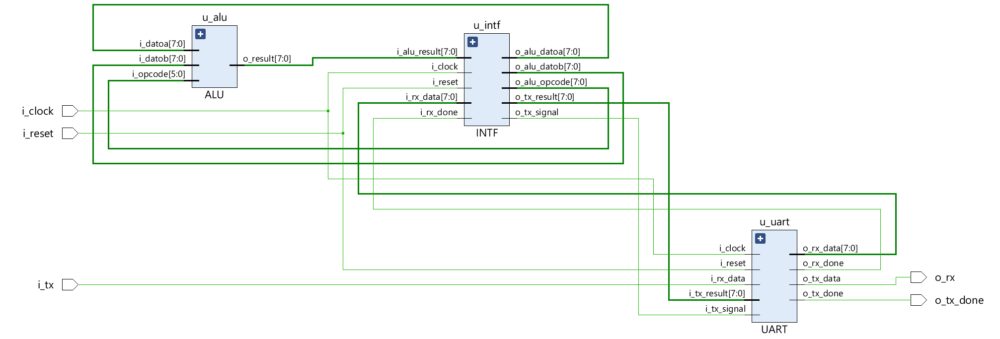

# TP2: UART
Segundo TP de arquitectura de computadoras: UART

## Francisco Daniele y Julian Gonzalez

### DESARROLLO
El trabajo consiste en integrar la ALU del primer trabajo practico (https://github.com/jukkanghost2/arqui-tp-alu) con un modulo UART que permita la comunicacion serial. Para esto es necesario un modulo intermedio llamado Interfaz que mantenga la coherencia entre la ALU y el UART.

#### MODULO UART
El modulo UART esta integrado por 3 modulos:
-    Baudrate Generator: 
-    RX:
-    TX:

---
#### MODULO TOP

---

