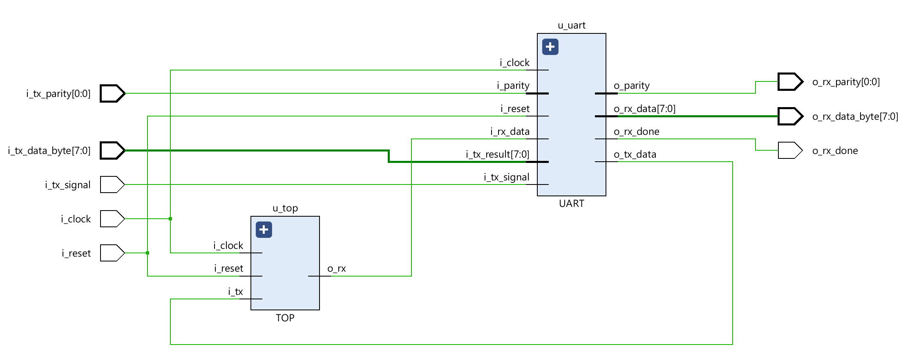
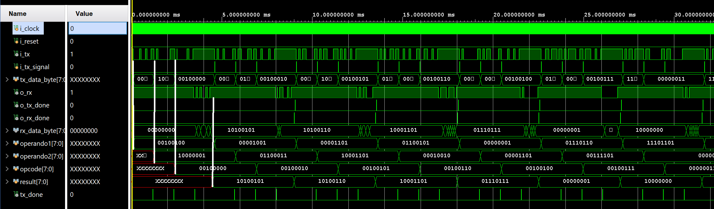

# TP2: UART
Segundo TP de arquitectura de computadoras: UART

## Francisco Daniele y Julian Gonzalez

### DESARROLLO
El trabajo consiste en integrar la ALU del primer trabajo practico (https://github.com/jukkanghost2/arqui-tp-alu) con un modulo UART que permita la comunicacion serial. Para esto es necesario un modulo intermedio llamado Interfaz que mantenga la coherencia entre la ALU y el UART.

### MODULOS
Para realizar este trabajo creamos, además de la ALU del trabajo anterior (_ALU.v_), 6 modulos de diseño más:
-   _BR_GENERATOR.v_
-   _UART_RX.v_
-   _UART_TX.v_
-   _UART.v_
-   _INTF.v_
-   _TOP.v_
Y para probarlos, creamos 7 testbenchs:
-   _prueba_brgenerator.v_ 
-   _prueba_rx.v_
-   _prueba_tx.v_
-   _uart_tb.v_
-   _prueba_intfalu.v_
-   _prueba_todo.v_
-   _top_test.v_

#### BAUD-RATE GENERATOR
Este modulo recibe como parametros una frecuencia de clock y el baud rate deseado, y en base a la señal de clock a la entrada genera a su salida ticks que manejan el ritmo de trabajo de UART.

#### UART RX
Es una FSM de 5 estados de tipo One-Hot One-Cold:
-   STATE_IDLE: en este estado la linea de dato recibido (_i_rx_data_input_) está en 1'b1 y si se pone en bajo significa que llegó un bit de start y pasa a ese estado.
-   STATE_START_BIT: este estado chequea que después de 7 ticks el bit siga en bajo lo que significaría que es un bit de start correcto y pasa al siguiente estado (STATE_RECEIVING). De lo contrario vuelve a STATE_IDLE.
-   STATE_RECEIVING: cuenta 15 ticks y toma el valor de _i_rx_data_input_ guardandolo en la posicion correspondiente de _data_byte_. Repite esto _DATA_WIDTH_ veces que es el largo en bits de la palabra recibida. A continuación pasa a STATE_PARITY_BIT.
-   STATE_PARITY_BIT: cuenta 15 ticks y toma el valor de _i_rx_data_input_ guardandolo en la posicion correspondiente de _parity_. Repite esto _PARITY_WIDTH_ veces. A continuación pasa a STATE_STOP_BIT.
-   STATE_STOP_BIT: Espera (15 ticks * cantidad de bits de stop) y si el valor de _i_rx_data_input_ está en alto pasa a STATE_DONE, que sería una trama de UART correcta. En el otro caso vuelve a STATE_IDLE porque se recibió una trama inválida.  
-   STATE_DONE: este estado pone en 1 el bit _o_done_bit_ avisando que se recibió un dato nuevo listo para usarse. Y luego va a STATE_IDLE.   

#### UART TX
Es una FSM de 5 estados de tipo One-Hot One-Cold:
-   STATE_IDLE: en este estado se fija que la señal que dice que hay un dato para transmitir (_i_tx_signal_) está en 1'b1. Si es así toma el dato (_i_data_byte_) y pasa a STATE_START_BIT.
-   STATE_START_BIT: este estado envía un 0 durante 15 ticks a _o_tx_data_ (sería el bit de start) y luego pasa a STATE_TRANSMITTING.
-   STATE_TRANSMITTING: mantiene durante 15 ticks en _o_tx_data_ el valor del bit correspondiente a _i_data_byte_ que fue guardado en el estado inicial. Repite esto _DATA_WIDTH_ veces que es el largo en bits de la palabra recibida. A continuación pasa a STATE_PARITY_BIT.
-   STATE_PARITY_BIT:  mantiene durante 15 ticks en _o_tx_data_ el valor del bit correspondiente a _parity_. Repite esto _PARITY_WIDTH_ veces. A continuación pasa a STATE_STOP_BIT.
-   STATE_STOP_BIT: Mantiene durante (15 ticks * cantidad de bits de stop) un 1 en _o_tx_data_ que sería el bit de STOP. Luego pasa a STATE_DONE   
-   STATE_DONE: este estado pone en 1 el bit _o_done_bit_ avisando que se terminó de transmitir el dato. Y luego va a STATE_IDLE.

#### UART
Es un modulo que agrupa los 3 anteriores generandose un modulo UART propiamente dicho.

---

#### INTERFAZ
Es una FSM de 4 estados de tipo One-Hot One-Cold. Se encarga de transmitir los operandos y el opcode recibidos desde el UART hasta la ALU y luego pasar el resultado de la operación realizada por la ALU hacia el UART.
-   STATE_OPA: en este estado si recibió la señal de UART_RX (_i_rx_done_ en 1) guarda el dato recibido (_i_rx_data_) y lo transmite a la ALU por _o_alu_datoa_. Luego pasa a STATE_OPB.
-   STATE_OPB: si recibió la señal de UART_RX (_i_rx_done_ en 1) guarda el dato recibido (_i_rx_data_) y lo transmite a la ALU por _o_alu_datod_. Luego pasa a STATE_OPCODE.   
-   STATE_OPCODE si recibió la señal de UART_RX (_i_rx_done_ en 1) guarda el dato recibido (_i_rx_data_) y lo transmite a la ALU por _o_alu_opcode_. Luego pasa a STATE_RESULT.   
-   STATE_RESULT: guarda el resultado que manda la ALU (i_alu_result) y lo pasa al UART_TX por _o_tx_result_ y pone en 1 _o_tx_signal_ avisandole que puede transmitir el resultado.

#### MODULO TOP
Esta compuesto por un modulo UART, una ALU y una Interfaz.

Además creamos para la simulación de este modulo el archivo _TOP2.v_ debido a problemas con la sintesis. Este diseño contiene una instancia de TOP y un UART conectado a el.

---

### SIMULACIONES
-   _prueba_brgenerator.v_ -> instanciamos un BR generator y nos fijamos que se produzcan los ticks.
-   _prueba_rx.v_ -> tiene un BR generator y un UART_RX, enviamos un bit de start, los 8 de datos, 1 de stop y revisamos que se haya recibido el dato correctamente.
-   _prueba_tx.v_ -> tiene un BR generator y un UART_TX, le damos un dato para transmitir, le damos la señal de que comience y hacemos una recepcióm "casera" de todos los bits transmitidos comprobando que haya salido todo bien.
-   _uart_tb.v_ -> tiene un BR generator, un UART_RX y un UART_TX. Conectamos el RX con el TX, le ponemos un dato al TX y esperamos un tiempo y luego revisamos que el RX recibió el dato correctamente.
-   _prueba_intfalu.v_ -> instanciamos una interfaz y una ALU. Le pasamos a la interfaz 2 operandos y el codigo de operacion y vemos que el resultado que nos da la ALU sea el correcto.
-   _prueba_todo.v_ -> instanciamos una interfaz, un BR generator, un UART_RX, un UART_TX y una ALU. Le pasamos 2 operandos y el codigo de operacion al RX bit a bit, este le pasa los datos a la interfaz y esta a la ALU que procesará el resultado y lo manda por la interfaz al TX. Revisamos que el TX transmita el resultado correcto de la operación que ingresamos por el RX. 
-   _top_test.v_ -> instanciamos un TOP y un UART que va a enviar los operandos y recibirá el resultado de la ALU por medio del UART del TOP. Le vamos pasando operandos random para cada opcode y con chequeo automatico nos fijamos que todo funcione correctamente.
-   _top2_test.v_ -> este testbench lo usamos para la simulacion de timing post synthesis del modulo TOP, instanciamos TOP2 y hacemos lo mismo que en el anterior.

